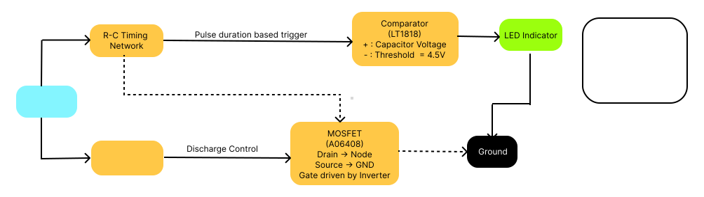

# Analog-Only Pulse Duration Detector

## TL;DR
An **analog-only pulse duration detector** designed in LTSpice to detect whether an incoming 5 V pulse exceeds a time threshold.  
- **Dynamic pulse duration setting** by adjusting RC resistor value (threshold voltage fixed at 4.5 V).  
- Built using **LT1818 high-slew-rate op-amp** and **AO6408 logic-level MOSFET** for precision and speed.  
- No microcontrollers or digital logic ICs — purely analog design.  
- MOSFET provides **fast capacitor discharge** after pulse ends for instant re-trigger capability.  
- Suitable for lab instrumentation, test equipment timing checks, and other analog measurement systems.

**Block Diagram:**

---

## Problem Statement
Design a circuit that detects when an incoming **5 V pulse** stays high longer than a specified duration.  
Requirements:
- Must be built entirely using **analog components**.
- Duration threshold should be adjustable without changing the voltage comparator threshold.
- Should reset instantly after the pulse ends.

---

## Skills Demonstrated
- **Analog circuit design** (timing, comparators, inversion stages).
- **Op-amp selection** based on **slew rate** and input characteristics.
- MOSFET gate control for fast discharge.
- Using LTSpice for simulation & verification.
- Designing without any firmware or digital logic ICs.

---

## Tools & Resources
- **Simulation Tool:** LTSpice XVII
- **Datasheets:** Op-amps & MOSFETs from TI / ON Semiconductor
- **Theory References:**
  - RC time constant formulas
  - Comparator configurations
  - Slew rate calculations
  - MOSFET switching behavior

---

## Top-Level Design
The design is modelled in **four stages**:

1. **Pulse Source** – Simulated 5 V pulse input in LTSpice.  
2. **Timing Network (R–C)** – Sets the time constant for the detection delay.  
3. **Comparator Stage** – Op-amp compares capacitor voltage to a fixed **4.5 V** reference.  
4. **Inversion & Reset Stage** – Op-amp + MOSFET combination inverts output logic and quickly discharges the capacitor when the input pulse ends.

---

## Component Choice Explanation

### 1. **Op-Amp – LT1818**
- **Reason for Selection:**  
  - Extremely **high slew rate** (2500 V/μs) ensures accurate detection of very short pulses.
  - Wide bandwidth (400 MHz) minimizes delay in comparison stage.
  - Operates comfortably on single 5 V supply used in the circuit.
- **Role:**  
  - Comparator stage to detect when the RC voltage crosses the 4.5 V threshold.
  - Inversion stage to drive the MOSFET gate for quick discharge.

---

### 2. **RC Network**
- **Reason for Selection:**  
  - Provides **adjustable time delay** for pulse duration detection.
  - Resistor value can be easily tuned without affecting the voltage threshold.
- **Role:**  
  - Sets the duration threshold for detection independently of the comparator’s voltage threshold.

---

### 3. **MOSFET – AO6408**
- **Reason for Selection:**  
  - **Low RDS(on)** (12 mΩ typical) for minimal voltage drop during discharge.
  - **Logic-level gate** fully enhanced at 4.5–5 V gate drive.
  - High pulsed drain current capability for rapid capacitor discharge without damage.
- **Role:**  
  - Acts as an active discharge path for the capacitor when the pulse goes low.
  - Ensures instant reset so the circuit can detect the next pulse without delay.

---

## Simulation Results
- **Tested Input:** Multiple pulse widths from sub-ms to several ms.
- **Observation:**  
  - LED glows when pulse duration > set threshold.  
  - Instant capacitor reset after pulse ends.  
  - Threshold voltage constant at 4.5 V regardless of duration setting.
- **Performance:** Detection time adjustable from ~0.5 ms to more than 10 seconds by changing R1.

---

## Learning Outcomes
- How to **replace digital logic** with pure analog circuitry.
- Importance of **slew rate** in pulse detection.
- Interfacing op-amps and MOSFETs for **fast recovery**.
- Using RC constants for **time-based control**.

---

## Future Expansion Options
- Adjustable **voltage threshold** for detecting non-5 V systems.
- Window comparator for detecting a **range** of pulse durations.
- Making the design PCB-ready for lab instrumentation.

---

## Use Cases in Current State
- **Lab Test Equipment:** Detect & flag long pulses in signal testing setups.
- **Industrial Controls:** Simple timer trigger without a microcontroller.
- **Educational Kits:** Demonstrates analog timing & comparator concepts.
- **Pulse Width QA:** Quick verification of control signals in prototypes.

---
